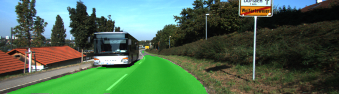

# Semantic Segmentation
### Introduction
In this project, I've labeled the pixels of a road in images using a Fully Convolutional Network (FCN) for an Image Segmentation excercise.

##### Implement
For this project I've labeled the pixels of a road in images from the vehicle frontal camera using a Fully Convolutional Network(FCN)
programmed in Python 3.6.1, Tensorflow 1.2.1, CUDA 8.0.61 running in an Ubuntu Ubuntu 16.04.2 running in a AWS Instance g3.4xlarge. 

I've setted the following hyper parameters since the resulting model seems to generalize well and do not over or under fit the test data in the dataset:

- Epochs: 25
- Batch Size: 1 (One 160x576 pixel RGB image)
- Learning rate: 0.0001
- Dropouts: 0.2

### Video Result
<video src="https://github.com/Adal-Glez/Semantic-Segmentation/blob/master/Image%20Segmentation%20Comparison.mov"></video>

### Images

 

       

### Setup
##### Frameworks and Packages
Make sure you have the following is installed:
 - [Python 3](https://www.python.org/)
 - [TensorFlow](https://www.tensorflow.org/)
 - [NumPy](http://www.numpy.org/)
 - [SciPy](https://www.scipy.org/)
 
##### Dataset
Download the [Kitti Road dataset](http://www.cvlibs.net/datasets/kitti/eval_road.php) from [here](http://www.cvlibs.net/download.php?file=data_road.zip).  Extract the dataset in the `data` folder.  This will create the folder `data_road` with all the training a test images.

Thanks for reading.
Adalberto
